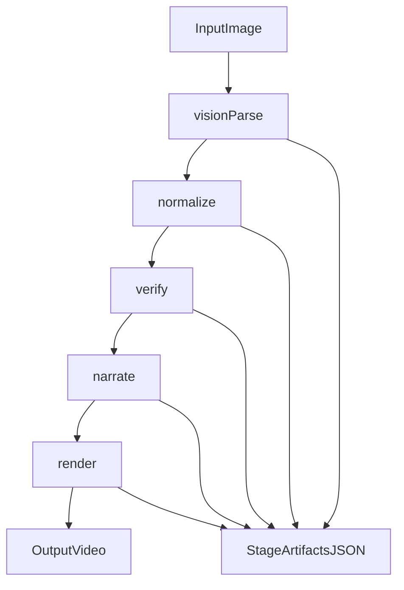

# Video-Simulation Architecture

## Pipeline

1. `vision_parse`: reads handwritten image with local VLM (if configured) or OCR fallback.
2. `normalize`: canonicalizes step strings and drops low-quality noise.
3. `verify`: performs symbolic equivalence checks with SymPy; never marks verified without passing checks.
4. `narrate`: creates pedagogical explanations and uncertainty labels.
5. `render`: generates Manim scene file and optional video output.

## Data Flow

## Artifact Layout

- `outputs/ocr_result_<timestamp>.json` - end-to-end artifact
- `outputs/generated_scene_<timestamp>.py` - generated Manim scene
- `outputs/stages/<timestamp>/vision_parse.json`
- `outputs/stages/<timestamp>/normalize.json`
- `outputs/stages/<timestamp>/verify.json`
- `outputs/stages/<timestamp>/narrate.json`
- `outputs/stages/<timestamp>/render.json`

## Local-Only Policy

- No cloud API calls are required.
- Optional VLM stage uses a local endpoint only (for example `127.0.0.1`).
- All inputs and artifacts stay inside `video-simulation/`.
